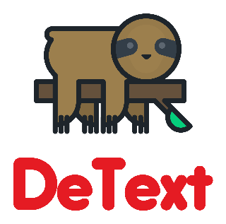
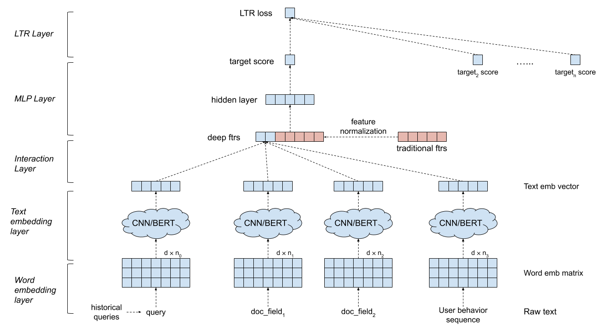

 **_"Relax like a sloth, let DeText do the understanding for you"_**

   

DeText: A Deep Neural Text Understanding Framework
========
**DeText** is a <b>_De_</b>ep **_Text_** understanding framework for NLP related ranking, classification, 
and language generation tasks.  It leverages semantic matching using deep neural networks to 
understand member intents in search and recommender systems. 

As a general NLP framework, DeText can be applied to many tasks, including search & recommendation ranking, 
multi-class classification and query understanding tasks.

More details can be found in the [LinkedIn Engineering blog post](https://engineering.linkedin.com/blog/2020/open-sourcing-detext).

## Highlight
* Natural language understanding powered by state-of-the-art deep neural networks
  * automatic feature extraction with deep models
  * end-to-end training
  * interaction modeling between ranking sources and targets
* A general framework with great flexibility
  * customizable model architectures
  * multiple text encoder support
  * multiple data input types support
  * various optimization choices
  * standard training flow control
* Easy-to-use
  * Configuration based modeling (e.g., all configurations through command line)

## General Model Architecture
DeText supports a general model architecture that contains following components:

* **Word embedding layer**.  It converts the sequence of words into a d by n matrix.

* **CNN/BERT/LSTM for text encoding layer**.  It takes into the word embedding matrix as input, and maps the text data into a fixed length embedding.

* **Interaction layer**.  It generates deep features based on the text embeddings.  Options include concatenation, cosine similarity, etc.

* **Wide & Deep Feature Processing**.  We combine the traditional features with the interaction features (deep features) in a wide & deep fashion.

* **MLP layer**. The MLP layer is to combine wide features and deep features. 

All parameters are jointly updated to optimize the training objective.

 

### Model Configurables
DeText offers great flexibility for clients to build customized networks for their own use cases:

* **LTR/classification layer**: in-house LTR loss implementation, or tf-ranking LTR loss, multi-class classification support.

* **MLP layer**: customizable number of layers and number of dimensions.

* **Interaction layer**: support Cosine Similarity, Hadamard Product, and Concatenation.

* **Text embedding layer**: support CNN, BERT, LSTM with customized parameters on filters, layers, dimensions, etc.

* **Continuous feature normalization**: element-wise rescaling, value normalization.

* **Categorical feature processing**: modeled as entity embedding.

All these can be customized via hyper-parameters in the DeText template. Note that tf-ranking is 
supported in the DeText framework, i.e., users can choose the LTR loss and metrics defined in DeText.

## User Guide
### Dev environment set up
1. Create your virtualenv (Python version >= 3.7)
    ```shell script
    VENV_DIR = <your venv dir>
    python3 -m venv $VENV_DIR  # Make sure your python version >= 3.7
    source $VENV_DIR/bin/activate  # Enter the virtual environment
    ```
1. Upgrade pip and setuptools version
    ```shell script
    pip3 install -U pip
    pip3 install -U setuptools
    ```
1. Run setup for DeText:
    ```shell script
    pip install . -e
    ```
1. Verify environment setup through pytest. If all tests pass, the environment is correctly set up
    ```shell script
    pytest 
    ```
1. Refer to the training manual ([TRAINING.md](user_guide/TRAINING.md)) to find information about customizing the model:
    * Training data format and preparation
    * Key parameters to customize and train DeText models
    * Detailed information about all DeText training parameters for full customization
1. Train a model using DeText (e.g., [run_detext.sh](test/resources/run_detext.sh))


### Tutorial
If you would like a simple try out of the library, you can refer to the following notebooks for tutorial
* [text_classification_demo.ipynb](user_guide/notebooks/text_classification_demo.ipynb)

    This notebook shows how to use DeText to train a multi-class text classification model on a public query intent 
    classification dataset. Detailed instructions on data preparation, model training, model inference are included.
* [autocompletion.ipynb](user_guide/notebooks/autocompletion.ipynb)

    This notebook shows how to use DeText to train a text ranking model on a public query auto completion dataset.
    Detailed steps on data preparation, model training, model inference examples are included.


## **Citation**
Please cite DeText in your publications if it helps your research:
```
@manual{guo-liu20,
  author    = {Weiwei Guo and
               Xiaowei Liu and
               Sida Wang and 
               Huiji Gao and
               Bo Long},
  title     = {DeText: A Deep NLP Framework for Intelligent Text Understanding},
  url       = {https://engineering.linkedin.com/blog/2020/open-sourcing-detext},
  year      = {2020}
}

@inproceedings{guo-gao19,
  author    = {Weiwei Guo and
               Huiji Gao and
               Jun Shi and 
               Bo Long},
  title     = {Deep Natural Language Processing for Search Systems},
  booktitle = {ACM SIGIR 2019},
  year      = {2019}
}

@inproceedings{guo-gao19,
  author    = {Weiwei Guo and
               Huiji Gao and
               Jun Shi and 
               Bo Long and 
               Liang Zhang and
               Bee-Chung Chen and
               Deepak Agarwal},
  title     = {Deep Natural Language Processing for Search and Recommender Systems},
  booktitle = {ACM SIGKDD 2019},
  year      = {2019}
}

@inproceedings{guo-liu20,
  author    = {Weiwei Guo and
               Xiaowei Liu and
               Sida Wang and 
               Huiji Gao and
               Ananth Sankar and 
               Zimeng Yang and 
               Qi Guo and 
               Liang Zhang and
               Bo Long and 
               Bee-Chung Chen and 
               Deepak Agarwal},
  title     = {DeText: A Deep Text Ranking Framework with BERT},
  booktitle = {ACM CIKM 2020},
  year      = {2020}
}

@inproceedings{jia-long20,
  author    = {Jun Jia and
               Bo Long and
               Huiji Gao and 
               Weiwei Guo and 
               Jun Shi and
               Xiaowei Liu and
               Mingzhou Zhou and
               Zhoutong Fu and
               Sida Wang and
               Sandeep Kumar Jha},
  title     = {Deep Learning for Search and Recommender Systems in Practice},
  booktitle = {ACM SIGKDD 2020},
  year      = {2020}
}

@inproceedings{wang-guo20,
  author    = {Sida Wang and
               Weiwei Guo and
               Huiji Gao and
               Bo Long},
  title     = {Efficient Neural Query Auto Completion},
  booktitle = {ACM CIKM 2020},
  year      = {2020}
}

@inproceedings{liu-guo20,
  author    = {Xiaowei Liu and
               Weiwei Guo and
               Huiji Gao and
               Bo Long},
  title     = {Deep Search Query Intent Understanding},
  booktitle = {arXiv:2008.06759},
  year      = {2020}
}
```
